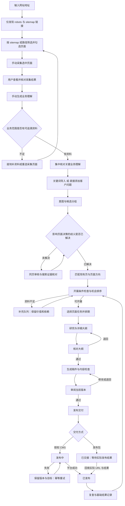

# Pagggle UX 方案 V0.1

日期：2026-10-08。依据：PRD V1.0。状态：用户已选定第二张设计（文档式布局、橙色强调），正在分步落地；完整业务流程尚未全部实现或经过真实用户可用性测试。

选定视觉基准：[第二张设计](selected-concept.png)。保留顶部工作区导航、左侧章节、中间业务文档、右侧核对清单。按钮按实际状态命名，核对选项不预选，业务资料取真实数据，不复制概念稿中的演示断言。

本方案补充界面、业务流、点击流与操作路径，不修改 P0/P1/P2 范围。先完成 M1，再实现 M2、M3。视觉稿使用明确标记的演示资料，不代表真实抓取、搜索或增长结果。

## 1. 用户真正要完成的事

用户要持续决定值得做哪些页面，并把选定页面稳定交付。AI 的抓取、抽取、聚类是后台步骤；用户主要负责确认关键业务事实、选择页面方向、审阅内容和授权交付。

设计目标：每个页面让用户知道“现在处理什么、为什么轮到我、完成后到哪里”。正常路径只有一个主要行动；补资料、退回、暂缓作为可见的辅助行动。只有发布或可能丢失修改的操作需要额外保护，不为普通导航增加确认弹窗。

## 2. 当前阶段界面的问题

本节记录初次设计时的问题；HTTP 监听现已恢复，最新走查见开发记录。浏览器截图文件写入被该工具的工作区限制拒绝，因此这里不是完整的带截图审计报告。

| 当前操作 | 问题 | 改进 |
| --- | --- | --- |
| 输入网站 → 查看 sitemap → 筛选页面 → 采集与核对 → 生成理解 | 用户需要先判断范围，自动读取数百页会跳过这一判断 | 每一步有明确落点；发现链接不采集正文，采集不自动调用模型 |
| 在资料列表与业务画像之间查找依据 | 用户需要在长列表中来回寻找；完整正文占用大量空间 | 主张旁显示可打开的来源标记，右侧查看原文、时间、范围；关闭后保留原位置 |
| 修订整个画像长表单 | 为改一条事实打开整个画像，难以识别真正需要确认的内容 | 默认展示待核对项，支持逐条纠正；完整画像和历史放在次级入口 |
| 全局确认按钮与单条事实状态同时存在 | 容易把“已核对画像”误读为所有事实已确认 | 分开表达“版本已核对”和“该主张企业已确认”；允许保留非阻塞未知项 |
| 突出展示记录数量、版本号和大量说明 | 没有回答下一步做什么，重要操作被计数和说明推后 | 首屏突出当前任务与下一步；数量变为列表计数；版本、用量进入详情 |
| 失败后重新运行整个采集 | 看见错误，却缺少对当前失败对象的直接操作 | 单页重试、补充文本、标记暂不处理；已读来源不重复覆盖 |

这些改进是设计要求，现有接口仍需按此调整，不能将原型按钮当作能力已完成。

## 3. 信息架构

遵循 PRD 的三个日常工作区，避免把模型流水线暴露为大量导航项。

| 位置 | 职责 | 默认看到什么 |
| --- | --- | --- |
| 网站优化 | 输入网站、筛选采集范围、核对业务 | 网站输入；sitemap 清单；采集进度与核对入口 |
| 机会清单 | 需求、问题组、页面方向、开展条件 | 必要维护单列；可开展机会；待补资料队列 |
| 页面任务 | 一项页面工作的完整上下文 | 当前阶段、本次需要的动作、相关证据 |
| 交付记录 | 本周安排、交接、发布、基础结果 | 本周 Blog 与产品页分开；阻塞和待登记结果 |
| 项目菜单：业务资料 | 业务理解、页面清单、企业事实与基调 | 已核对版本、待确认项、补充资料入口 |
| 项目菜单：设置 | 目标市场语言、交付节奏与接入配置 | 用户可理解的业务设置；密钥继续留服务端 config.json |

未开发模块不伪装成可用页面。视觉探索可以展示完整导航；实际交付必须标明实现范围。

## 4. 端到端业务流

必要维护任务进入独立优先队列，再进入同一页面任务流程。关键词不是必须入口；客户问题、资料变化也直接进入候选需求。

## 5. 关键点击流

### F01 首次接入 → 可核对的网站理解（M1 / FR01–FR02）

1. 从“网站优化”输入网站地址，选填项目名和本轮采集数量上限。默认不限数量；同一网址沿用原项目，不覆盖已有核对版本。
2. 点击“发现站点页面”，只读取 robots 和 sitemap（含子地图），展示发现进度与失败原因；不读取网页正文、不调用模型。
3. 进入“筛选要采集的页面”，按 sitemap 或网址路径检索。默认不勾选；支持选择当前筛选结果、逐页勾选、清空。数量参数限制选中页数，超出时提示调整，不截断清单。
4. 点击“采集选中 N 页”，只读取选择的页面，不继续追读正文链接。完成后主要入口为“先查看采集结果”，保留未覆盖与失败状态。
5. 用户查看原始内容后，手动点击“根据这 N 页生成业务理解”。仅针对所选且成功读取的来源分析；全文分批，不按固定页数或正文头部截取。新版本显示实际来源范围，不能将局部范围冒充全站。
6. 进入“核对业务理解”，查看来源并逐项选择“信息正确”“修改”“暂时无法确认”。企业确认与原文陈述分开保存。
7. 当前试点停在用户解析验收；经用户确认后再继续需求流程。已有人工修订和历史版本保持可追溯。

验证要点：链接发现、正文采集、模型理解是三个独立任务，后两步都需用户发起；0 选中不可采集；跨项目来源不可提交；失败不产生伪完整画像。默认不限是数量参数，不等于自动选中全站。sitemap 并不保证包含站点所有页面，界面必须区分已发现、已读取、未覆盖及失败。

### F02 添加需求 → 页面机会（M1 / FR03–FR08）

1. 在机会清单点击“添加需求”，默认粘贴关键词，可切换“导入表格”或“客户问题”。
2. 关键词先给导入预览，显示原始条数、完全重复条数、有效条数、待解释与失败条数；缺失搜索指标显示“未知”。
3. 确认导入后后台处理，只把需要决策的分组问题进入审核队列。
4. 点击问题组，原位展开主要客户任务、成员和边界；边界词可拆出、合并建议可核对，保存原因。
5. 查看页面建议时，先显示“更新哪页 / 新建什么 / 为什么现有页接不住”，再展开搜索、业务与内容依据。
6. 用户点“选择任务”，设置负责人、目标周和依赖；如果缺关键事实，主行动改为“补齐资料”，保留该机会。

返回行为：关闭详情后保留筛选条件、滚动位置和选中行。用户在资料或搜索证据页面完成补充后，回到原问题组，不跳回首页。

### F02a 用户指定的两阶段关键词聚类（独立候选路径）

用户本轮明确授权按 engine 设计实现，网站解析保持待验证。此路径可从“机会清单 → 关键词聚类”独立进入，不触发网站分析或意图 API。

1. 导入 CSV/XLSX 或粘贴关键词，可附搜索量、KD、SERP URL 与市场快照信息。
2. 预览有效、重复、失败及每词 SERP 条数，确认保存后生成候选分组。
3. 列表显示主词、语义主题、成员数、指标、待审核/待补证据；点击主词原位打开成员与具体重合 URL。
4. 缺失数据不填零，链式关联明确待审；每组一个建议主词，不将候选组自动变为新建 URL。
5. 重新运行保留旧结果，版本可切换。正式同页确认及人工拆合仍待后续实现。

### F03 页面任务 → 大纲 → 审稿（M2 / FR09–FR11）

1. 从机会详情创建任务，自动带入页面方向、企业画像版本、问题组和证据，不让用户重新填写。
2. 任务页显示当前阶段与当前主要操作。方向、研究、大纲、稿件、记录留在同一任务中切换。
3. 大纲按模块显示要回答的问题、要点、证据和待补项。点“通过大纲，开始写作”后才进入写作；退回时就地填写原因。
4. 稿件页默认正文预览，点击主张可看引用；更新旧页时可切换差异视图。技术或产品人员可聚焦事实核对项。
5. 直接编辑保留人工修改；重新生成必须生成独立版本，展示差异，不覆盖现稿。
6. “通过此版本”绑定具体内容版本。编辑已批准内容立即变为待复核，旧批准不能继续授权交付。

### F04 周计划 → 交付 → 结果（M3 / FR12–FR13）

1. 周计划分别展示 Blog 和产品页；默认目标保留每周至少两篇 Blog，产品页单列。
2. 阻塞条目显示缺什么、谁确认、截止时间和可替代任务。不能为完成数量编造内容。
3. 已审核任务点击“准备交付”，预览正文、标题描述、内链、素材说明和目标 URL。
4. 未接 CMS 时主要行动为“导出发布包”，完成后状态为“已交接”。
5. 人工交付后通过“登记发布结果”填写实际 URL、时间和结果。只有有依据的成功才能变为已发布。
6. 已接 CMS 时显示明确目标及授权动作，成功记录实际平台结果；失败重试复用幂等标识。
7. 复查时搜索表现与实际询盘分开填写；询盘排除垃圾、重复、测试，缺失指标保留未知。

### F05 新资料或画像纠错 → 受影响任务（M1 数据基础，M2/M3 使用）

1. 从业务资料或任务内的引用入口纠正事实，填写修订依据。
2. 保存新版本，展示受影响的任务及其引用；只标记相关任务需要核对。
3. 回到原任务继续处理。无关任务不重新生成，已发布页不被自动覆盖。

## 6. 屏幕与主要行动契约

| 屏幕 | 用户需要判断什么 | 唯一主要行动 | 辅助行动 | 完成落点 |
| --- | --- | --- | --- | --- |
| 网站接入 | 要了解哪个网站 | 发现站点页面 | 查看历史结果、设置数量 | 发现进度 |
| 页面筛选 | 本轮需要读取哪些页面 | 采集选中 N 页 | 按 sitemap / 路径筛选、调整上限 | 采集进度 |
| 采集完成 | 正文是否正确、范围是否合适 | 先查看采集结果 | 手动生成业务理解、重新筛选 | 原文核对或理解进度 |
| 理解完成 | 来源和业务判断是否准确 | 核对业务理解 | 查看失败原因、重试 | 业务理解审阅 |
| 核对业务理解 | 系统是否理解关键业务 | 下一步：添加内容需求；已有建议时为查看页面建议 | 修正、看依据、稍后处理非阻塞项 | 需求输入或已有页面建议 |
| 机会清单空状态 | 从哪些真实需求开始 | 添加需求 | 查看业务资料 | 导入预览或客户问题表单 |
| 机会详情 | 为什么做、做什么、是否能开始 | 选择任务；阻塞时为补齐资料 | 调整方向、暂缓 | 页面任务或原位补资料 |
| 大纲待审 | 关键问题是否覆盖且有依据 | 通过大纲，开始写作 | 修改、退回研究 | 写作状态 |
| 内容待审 | 当前稿能否交付 | 通过此版本 | 修改、退回、查看差异 | 待交付 |
| 待交付 | 发布到哪里、交付哪个版本 | 导出发布包或发布到已授权 CMS | 预览、返回审稿 | 已交接或平台结果 |
| 已交接 | 是否实际发布成功 | 登记发布结果 | 查看发布包 | 已发布或交付失败 |
| 待复查 | 有何结果、下一步做什么 | 记录复查 | 更新页面、暂缓观察 | 后续建议 |

同一状态只显示适用操作。禁用按钮需要可理解的原因和解决入口，不能只变灰。

### “机会”的具体含义与入口文案

产品中的机会是“值得更新、补充或新建的具体页面工作”，不是销售线索名单，也不意味着已经查询到搜索量、低竞争词或排名承诺。系统结合企业业务、客户问题、关键词及现有页面，解释为什么做、当前页能否承接、缺哪些资料，再由用户选定任务。

页面建议包括：为现有产品/定制页补充采购判断信息；更新无法回答目标问题的原页面；在现有页面不能充分承接时建议新建内容；资料不足时保留机会并补资料。一个词不等于一个新页面。

文案必须对应实际可执行的目标：

| 已完成业务核对后的状态 | 下一步按钮 | 点击结果 |
| --- | --- | --- |
| 还没有关键词或客户问题 | 下一步：添加内容需求 | 选择粘贴关键词、导入表格或添加客户问题 |
| 已有需求，分析尚未开始 | 分析内容需求 | 进入可恢复的意图与分组处理 |
| 正在分析 | 查看分析进度 | 返回现有任务，不重复创建 |
| 有关键歧义或分组冲突 | 核对需求分组 | 定位待核对问题，不跳过边界验证 |
| 已有页面方向与依据 | 查看页面建议 | 打开建议列表，查看更新/新建理由与开展条件 |

“开始找机会”不再作为主按钮文案。此前生成的图片属于视觉探索，实施时以此状态规则为准。

## 7. 异常与恢复路径

| 场景 | 用户看到什么 | 可操作入口 | 恢复位置 |
| --- | --- | --- | --- |
| URL 错误、跨域跳转 | 指明地址问题，不展示内部堆栈 | 修改地址 | 该次接入 |
| 抓取失败或动态正文不可读 | 哪些页面失败、哪些仍可用 | 单页重试 / 粘贴内容 / 暂不处理 | 原资料或核对项 |
| 模型失败或结构不合法 | 当前阶段未完成，已有资料保留 | 重试该步骤 | 原分析阶段 |
| 资料不足 | 缺哪项、影响哪个业务判断 | 补充材料 / 保留待确认 | 原核对项或任务 |
| 事实来源冲突 | 两方来源与各自范围 | 企业确认 / 保持冲突 | 原主张 |
| 意图/分组歧义 | 候选解释与受影响成员 | 调整分组 / 补搜索证据 | 原问题组 |
| 搜索数据未知 | 明确“未知”与来源缺口 | 导入或人工登记 | 原页面决策 |
| 并发修订 | 新版本已存在，本次输入仍保留 | 查看差异后重新应用 | 原编辑器 |
| 离开未保存编辑 | 告知哪些更改尚未保存 | 保存 / 放弃 / 继续编辑 | 用户选择的原位置 |
| 发布失败 | 当前版本、目标与失败原因 | 重试 / 改为发布包 | 原交付记录 |
| 服务中断 | 哪一步中断、已完成部分仍可见 | 恢复或重试 | 原任务阶段 |

## 8. 视觉与交互约束

- 现代简约 SaaS：以中性底色、清晰字阶、对齐与行分隔建立层级，单一强调色集中用于主要动作。
- 日常工作页不使用营销口号式大标题，不将每个信息块包成大卡片，不展示没有决策价值的统计墙。
- 默认正文 14–16px；重要说明不依赖 10–11px 浅灰小字。状态同时使用文本，不能只靠颜色。
- 列表适合扫描，详情适合判断；原文、审阅记录和版本信息按需展开。
- 成功反馈说明“保存了什么、下一步到哪里”。失败反馈说明“影响什么、怎样继续”。
- 表单有清晰标签、行内校验和键盘操作；弹窗关闭后焦点返回原按钮。长任务进度供辅助技术读取。
- 小屏先保证阅读、确认和补资料；复杂分组/长稿编辑采用单栏或全屏详情，不能压缩成难点的小控件。

## 9. 分步设计验收

以下是待验证的设计验收任务，不是已经测量的效率或成功率。

| 轮次 | 走查任务 | 通过条件 |
| --- | --- | --- |
| UX-1 | 从网址到核对业务理解 | 正常路径无需人为调度采集与提取；每个失败状态都有入口和返回路径 |
| UX-2 | 从一条客户问题到可开展页面任务 | 无需伪造关键词；现有页匹配和新建理由清楚；缺资料可保留机会 |
| UX-3 | 从任务到审核后的当前稿 | 上下文不重复填写；证据可看；修改使批准失效；不会丢人工编辑 |
| UX-4 | 从已审稿到实际发布记录 | 已交接与已发布严格区分；失败可恢复；重试不会重复发布 |
| UX-5 | 关键操作的返回、取消及键盘走查 | 筛选与位置保留；未保存修改受保护；焦点与错误提示可理解 |

进度：三种视觉方向已生成，用户选择第二张；UX-1 的页面与需求输入已接入应用，并通过合成接口的浏览器点击流走查。真实服务、模型和站点验证仍受运行环境权限阻塞。M1 未完成前不把 M2/M3 原型当作已交付功能。
